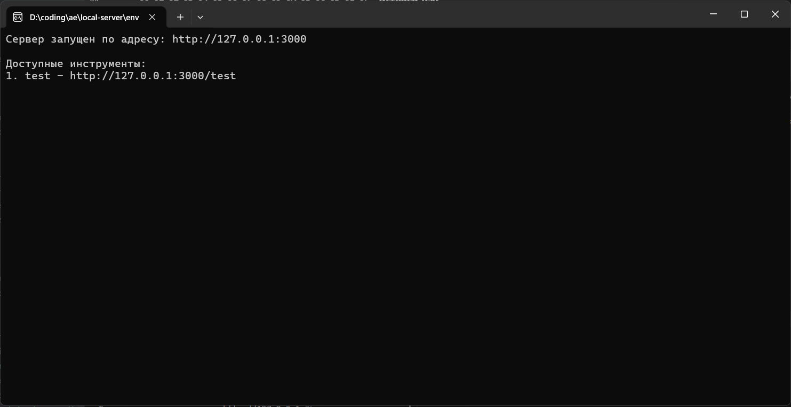
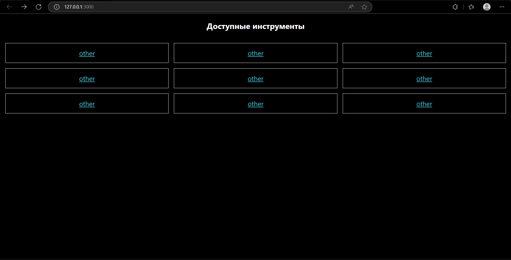
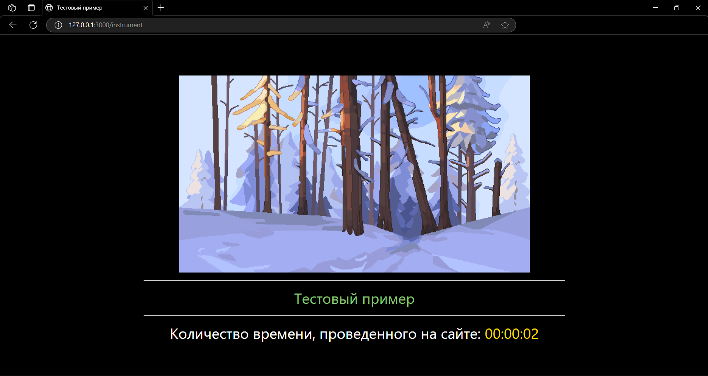

## Локальный сервер для инструментов моддинга игры `Герои Энвелла`

### Как использовать

1. [Скачать программу](https://github.com/Rul991/envell-tools-local-server/releases/latest)

2. Запустить программу

3. В папке, где находится exe'шник, появится папка `sites/`. Туда вставить одну или несколько папок, каждая должна содержать `index.html`. 
   - Пример: [***Клик***](example)

4. Если вы хотите использовать статичные файлы(css, js, png, jpg и т.д.), создайте внутри `sites/<название-папки>/` подпапку `assets/`, в которую положите все необходимые файлы.

5. Перейдите по адресу: `127.0.0.1:3000`

6. Появятся несколько ссылок, выберите нужную(название ссылки соответствует название папки)

7. Профит!!!

### Скриншоты работы сервера

> **При запуске сервера**
>
> - 

> **Главная страница**
>
> - 

> **Тестовый пример**
>
> - 

### Ссылки:

- *Репозиторий движка игры*: [*Клик*](https://github.com/traeterno/Ae2D) 
